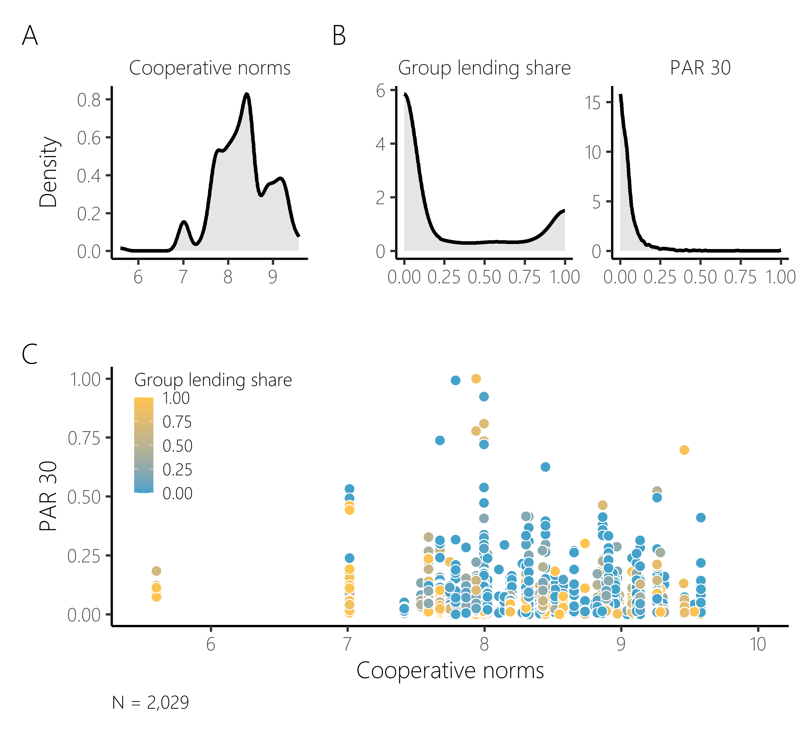
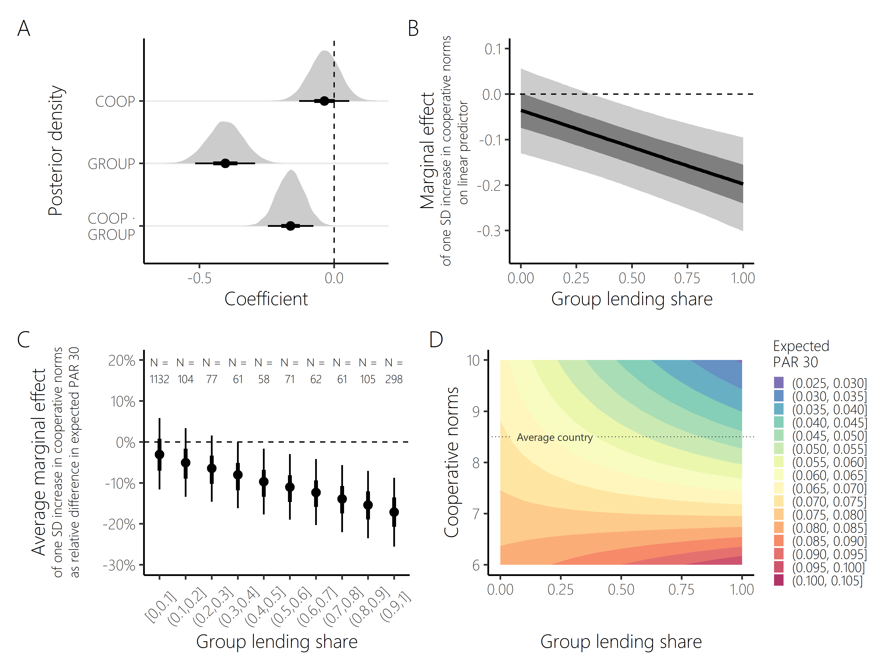
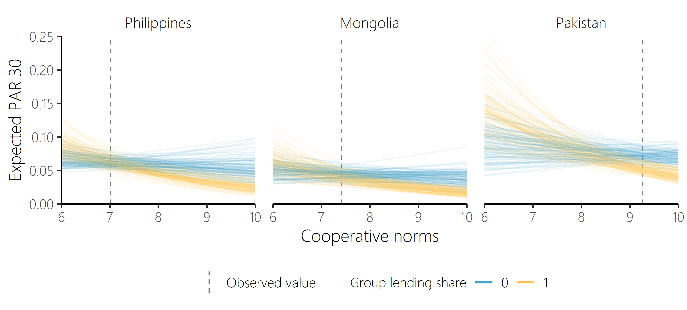
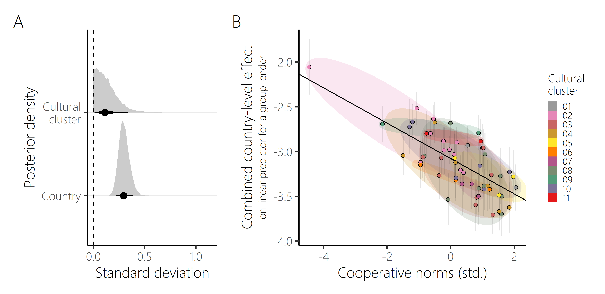
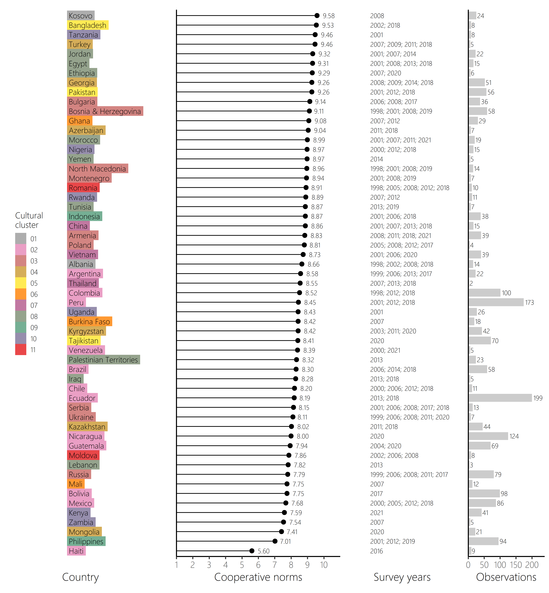
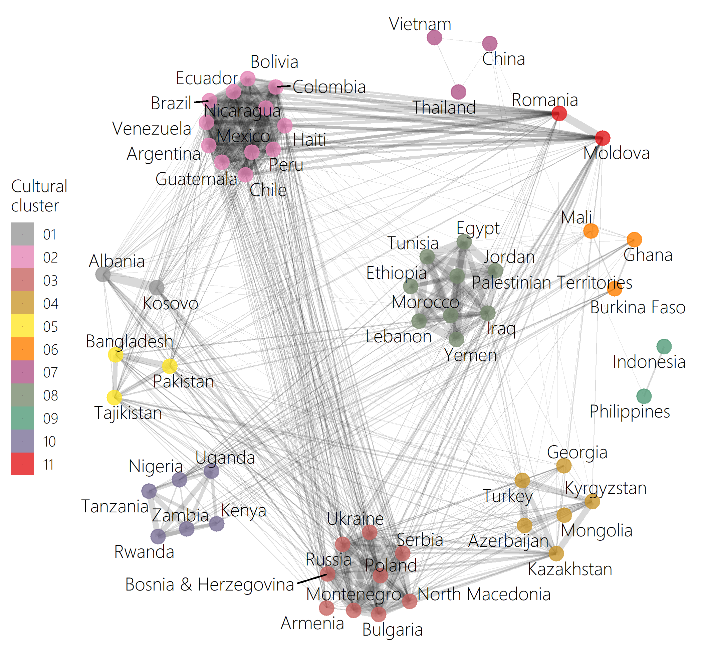
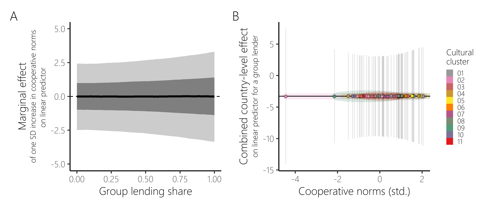
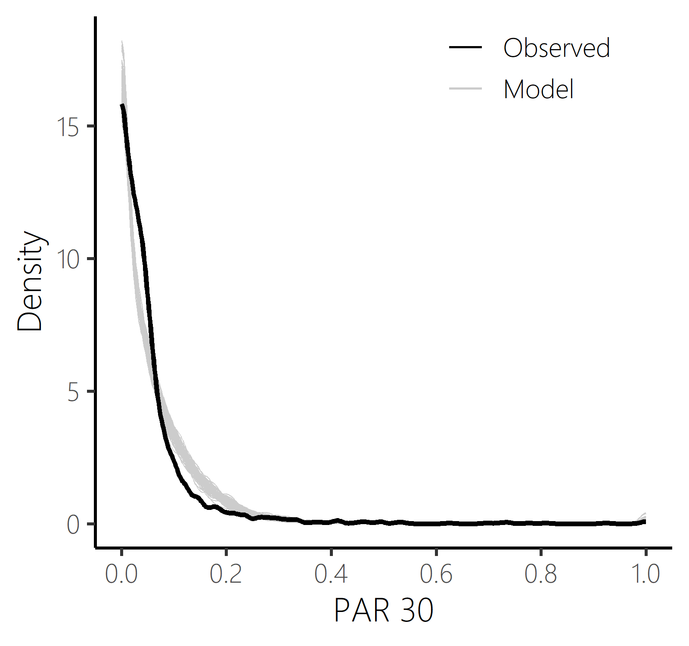
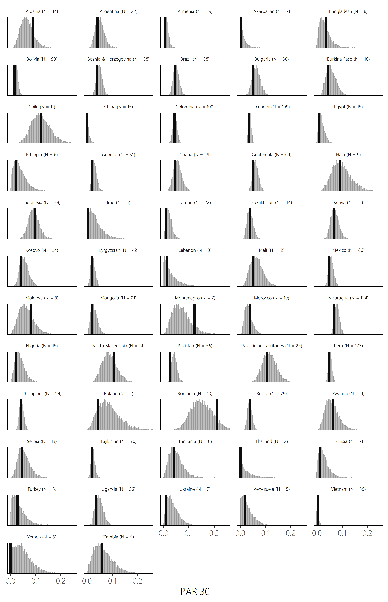
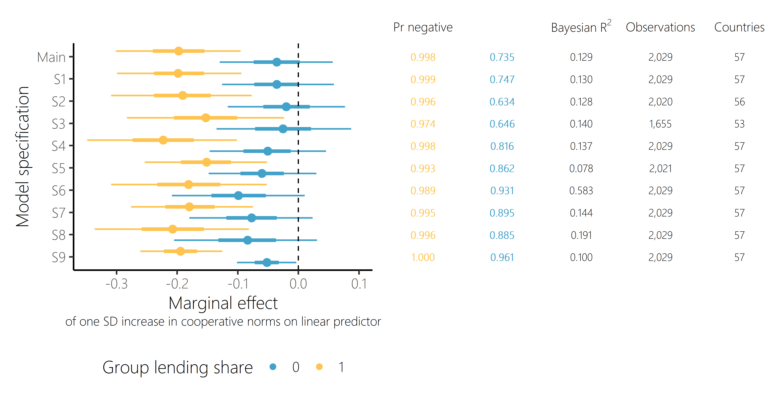

```{r setup, include=FALSE}
library(knitr)
library(kableExtra)
library(tidyverse)
library(lme4)
knitr::opts_chunk$set(echo = FALSE, message = FALSE, warnings = FALSE, cache = FALSE, fig.align = "center", fig.pos = "H")

# import data and tables from main model used for report
mainmodel             <- readRDS(file = paste0("modelfiles/m_main.rds"))
s_mainmodel           <- summary(mainmodel)
df                    <- read_csv(paste0("modelfiles/data_model_unscaled_main.csv"), show_col_types = FALSE)
df_cultmap            <- read_csv2("utils/Cultural_Map.csv")
descrtab              <- readRDS("outputs/tab_descriptives_main.rds")
modeltab              <- readRDS("outputs/tab_model_main.rds")
icepttab              <- readRDS("outputs/tab_varyicepts_main.rds")
coefftab              <- readRDS("outputs/tab_adjcoeff_main.rds")
corrm                 <- readRDS("outputs/tab_corrm_main.RDS")
mcor_ling             <- readRDS("outputs/mcor_ling.RDS")
r2                    <- readRDS("outputs/r2_main.RDS")
mor                   <- readRDS("outputs/mor_main.RDS")
ests_all              <- readRDS("outputs/ests_all_main.RDS")
prob_neg              <- readRDS("outputs/prob_neg_main.RDS")
mcor_reg              <- readRDS("outputs/mcor_reg.RDS")
mcor_zon              <- readRDS("outputs/mcor_zon.RDS")
cronb_alpha_coop_wevs <- readRDS("utils/cronb_alpha_coop_wevs.RDS")
corrm_wevs            <- readRDS("utils/corrm_wevs.RDS")
coop_studies          <- readRDS("utils/coop_studies.RDS")
cor_wallet            <- readRDS("utils/cor_wallet.RDS")

intcp_prior <- as_tibble(mainmodel$prior) %>% 
  filter(class == "Intercept") %>% 
  pull(prior) %>% str_to_title

stopifnot(length(intcp_prior)==1)
```

\pagebreak

# Introduction {#introduction}

Microcredit is one of the most prominent financial development interventions in low- and middle-income countries. Its principal aim is to increase business activity among the poor by removing credit constraints and improving access to finance. Along with other services such as savings or insurance, it is a cornerstone of the microfinance industry, which as of today serves more than 200 million borrowers globally [@microcredit_summit_campaign_mapping_2015] and plays an important role in the financial lives of many low-income households around the globe [@cull_microfinance_2018].^[Some rigorous empirical analyses have cast doubt on the transformative effects of microcredit for growth and development [@meager_understanding_2019; @duvendack_what_2011]. Quantifying the impacts of microcredit remains a topic of ongoing research and debate [see also @morduch_why_2020; @bateman_misunderstanding_2019].]

One central goal of microfinance institutions (MFIs) is to deliver credit and other financial products to low-income clients who are excluded from the mainstream banking system. Typically, this involves a set of design features like small loan sizes, short loan cycles with frequent installments, or a focus on women [@armendariz_economics_2010]. Further, many MFIs employ group-based lending, as famously popularized by the Grameen Bank who pioneered the microcredit movement in the 1980s and 1990s.^[Grameen loan groups have traditionally consisted of five members, but loan group sizes vary within and between MFIs, often in the range of about three to 25 members.] The strictest form of group lending is the signing of joint liability contracts, which bestow the responsibility of timely loan repayment onto groups rather than individuals. Given that loans to the group would only be extended if the shares of all group members are repaid on schedule, this generates an incentive among loan group members to select into economically viable groups and look after each other's loan investment and repayment decisions by using the information and "social collateral" embedded in their local peer relationships [@armendariz_economics_2010, ch. 4; @ghatak_economics_1999; @besley_group_1995; @stiglitz_peer_1990].

Unsurprisingly, however, despite its appeal in theory, group lending is not a silver bullet and various group-based microfinance programmes have been reported to fail [@haldar_group_2016; @woolcock_learning_1999]. In fact, there is a broad international trend of MFIs increasingly switching from group to individual lending [@ahlin_matter_2019; @de_quidt_commercialization_2018]. Robust empirical evidence on the effectiveness of group lending in raising repayment discipline and thereby borrower welfare is scarce, and existing comparative studies yield heterogeneous results [@attanasio_impacts_2015; @gine_group_2014; @mahmud_repaying_2020; @carpena_liability_2013].

Considering the mixed success in the real world, what makes group lending work? It has been argued that the collective repayment responsibility inherent in group lending can create public goods dilemmas that require cooperation [@gehrig_banking_2021; @lamba_comparison_2014], or, put differently, some form of social capital^[We understand the term social capital in the tradition of @putnam_prosperous_1993: "By analogy with notions of physical capital and human capital -- tools and training that enhance individual productivity -- 'social capital' refers to features of social organization, such as networks, norms, and trust, that facilitate coordination and cooperation for mutual benefit."] that motivates the personal contribution of effort to resolving the group debt [@karlan_social_2007]. That is because personal rent-seeking motives might compromise individual group members' decisions on, for example, the viability of the own business project (often called *ex ante* moral hazard), the effort put into peer monitoring, the amount of financial information gathered about and provided to their peers, the honesty with which own investment outcomes are disclosed to the group, the level of financial support provided to others in repayment problems, or whether to strategically withhold the own repayment share (often called *ex post* moral hazard). Such free-riding behavior on the efforts of other loan group members might create individual short-term benefits, but ultimately decreases the likelihood of successful group repayment and therefore the collective reward by the microlender in form of extension or upgrade of the loan. Accordingly, @sabin_able_2020[p. 1607] describe the group loan setting as "a social dilemma in which there is a tension between the interests of the individual (i.e., to leave the repayment burden with the other members) and of the group (i.e., maintain collective access to future credit)".^[The public goods structure is also implicit in many game-theoretic models of group lending [e.g., @che_joint_2002; @guttman_repayment_2007].]

In this paper, we investigate the relationship between one key driver of cooperative behavior -- society-wide normative expectations about cooperation and free-riding -- and repayment outcomes recorded by MFIs, conditional on the degree to which they employ group vs. individual lending. Social norms and beliefs are a major driving force of human behavior and essential components of a society's cultural makeup. By shaping our institutions, they also play an important role in economic and financial transactions [e.g., @bowles_microeconomics_2003].^[Recent literate in particular emphasizes how culture affects lending and borrowing [@osei-tutu_individualism_2023; @nicolas_disentangling_2023].] The cross-cultural approach we take extends previous studies on the relation of cooperative behavior and group loan repayment, which have chiefly focused on the micro level by comparing groups of the same MFI in a fixed geographical and cultural context. These studies are reviewed in more detail in section \ref{relatedliterature}. With the focus on variation in societal norms, we echo the call by @haldar_group_2016 to understand group borrowers' social capital more broadly, encompassing not only enforcement threats associated with peer monitoring and close-knit reciprocal relationships, but also generalized norms of prosocial behavior. Indeed, lab-in-the-field experiments with microfinance clients in Pakistan show how motivations of guilt and shame aversion drive loan repayment, which, according to the authors, "illustrates the powerful role played by empirical and normative expectations and highlights the human predisposition to follow norms" [@dhami_psychological_2022, p. 13]. This warrants a sound empirical analysis of the effect of between-population variation in social norms of cooperation on microcredit delinquency.

The data and methods we employ allow to overcome some important limitations of pre-existing works that have regressed indicators of MFI performance on country-level measures of social norms and beliefs (see section \ref{relatedliterature}). In Bayesian hierarchical models, we show that stronger societal norms against free-riding are associated with lower records of loan delinquency. The effect size increases in the share of group lending employed by an MFI. The estimated model also implies that group lending requires some basic amount of cooperative norms to work at all. The accounting for many potential confounders and multiple sources of variation, including the cultural non-independence of contemporary countries [e.g., @bromham_parasites_2018], and the robustness of our findings to alternative specifications give us confidence that we have indeed revealed a contextual factor afffecting microborrower behavior and hence microfinance viability more broadly. As a consequence, we would advise practitioners to acknowledge the informal institutional environment in the design of contracts and lending procedures, for example by substituting a lack of informal cooperative norms with a modest amount of collateral. 

\pagebreak

# Related literature {#relatedliterature}

## Previous research

The empirical literature on causes and correlates of repayment success in group lending builds on three popular study designs: (i) comparisons between real loan groups, (ii) assessments of artificial loan groups in lab-in-the-field experiments, and (iii) cross-country comparisons of MFI outcomes. 

The former studies typically compare pre-existing groups of the same MFI in a given country or community. Variation between loan groups in characteristics such as geographical distance between group members, homogeneity of members in some characteristic, or the strength of their social and cooperative ties is assessed in relation to measures of loan default or repayment delay [e.g., @ahlin_using_2007; @sharma_repayment_1997; @wydick_can_1999; @paxton_modeling_2000; @anthony_cooperation_2005; @van_bastelaer_trust_2006; @karlan_social_2007; @al-azzam_repayment_2012; @sabin_able_2020].^[Parts of this literature are reviewed by @gehrig_banking_2021 and @al-azzam_complex_2020.] Similar to the current study, some of these studies explicitly investigate measures of so-called "cognitive social capital" like norms, attitudes and beliefs. For example, @al-azzam_repayment_2012 report groups whose members adhere more strongly to religious norms to repay more timely. @van_bastelaer_trust_2006 find that loan groups in villages where people expect others to generally take less advantage of each other have higher repayment rates. These studies statistically adjust for a host of other variables, but endogeneity remains a concern for many of them. 

In lab-in-the-field experiments researchers have more control over group composition and types of interaction, so they have become a popular tool to study group lending from the perspective of contract design [e.g., @flatnes_little_2019], psychological mechanisms [e.g., @dhami_psychological_2022], or group member characteristics [e.g., @cassar_does_2010]. As an example that supports the conjecture investigated in this study, @cassar_does_2010 find higher contributions among borrowers with stronger beliefs about the trustworthiness, fairness, and helpfulness of others in their society in stylized group lending experiments across five countries. 

Methodologically most closely related to the current study are previous studies on the macro level, relating MFI financial performance metrics like operational self-sufficiency to national culture and societal values [e.g., @manos_determinants_2014; @postelnicu_microfinance_2018].^[Some studies also look at effects on MFIs' *social* rather than only *financial* performance, proxied for example by share of female borrowers or average loan size. Since our focus is on repayment behavior of borrowers rather than MFIs' missions, we omit this aspect.] The hypothesized link between the two is due to borrower and lender behavior: Where social norms prescribe little trust or mutual support, the "soft" approaches of MFIs to reduce transaction costs and motivate repayment might be less effective. Thereby, a lack of conducive social norms in their local environment could ultimately harm MFIs' financial performance. Here, we highlight three such studies which more directly measure repayment behavior. Like the current study, they quantify how proxies for between-country variation in prosocial norms and beliefs affect loan repayment, using a combination of national-level survey data and MFI panel data on loan arrears.

@burzynska_impact_2015 fit linear and quantile regressions including MFI- and country-level predictors and show a robust conditional association between higher generalized trust in a society (measured by the proportion of people who think that "most people can be trusted" in the World Values Survey, henceforth WVS) and lower repayment delinquency and interest rates of MFIs. Based on their analysis of 37 countries, they propose that "MFI financial performance not only relies on the macroeconomic and formal institutional environment, as the current empirical literature suggests, but is also closely related to social beliefs, particularly trust and norms of cooperation." (p. 1093). @jordan_role_2019 find a positive effect of the societal level of inequity aversion (as measured in Ultimatum Games in 13 countries) on repayment delinquency of microborrowers, but *no* evidence for an effect of generalized trust or civic cooperation.^[The latter is a measure derived from WVS questionnaire items on the justifiability of cheating behaviors and is very close to the measure of cooperative norms in the current paper presented in section \ref{data}.] Such differences in conclusions are probably at least partially due to different methods, which is a pervasive problem for the comparability of studies in the empirical microfinance literature more generally. Finally, whereas the two previously mentioned studies use international MFI data from MIX Market database (as we do in the current paper, see section \ref{data}), @chmelikova_performance_2018 draw on the European Microfinance Network panel. They infer that, conditional on many other MFI- and country-level variables, MFIs in European societies that are higher in generosity (as measured by self-reported donation behavior in the Gallup World Poll) experience less repayment delays.

## Contributions of the current paper {#contributions}

Although suggestive that societal norms of prosocial conduct can affect microloan repayment, previous analyses face some important limitations, which we attempt to overcome. First and foremost, they ignore an MFI's actual degree of group vs. individual lending. According to dominant economic and sociological theories of microcredit (see cited literature in section \ref{introduction}), however, it is group rather than conventional individual-based lending that hinges on social interactions and peer relationships among borrowers. We consider it a priori unlikely that norms of cooperation have an identical effect, if any, on repayment of group debt and private debt. Therefore, we rely on data that allows to condition the effect on the degree to which an MFI relies on group lending. In terms of our model, this means that we include an interaction effect between cooperative norms and group lending to see if and how effect modification occurs.

Second, by combining multiple surveys, including the most recent WVS wave, we can use the to date largest sample of countries to analyze effects of prosocial norms on microcredit repayment. Besides more reliable estimates, the widened regional scope of the analysis should improve external validity.

Third, previous analyses have largely neglected the nested structure of the data, thereby increasing the risk of confounding bias and underestimation of uncertainty. MFIs in the same country are exposed to many similar contextual effects, potentially correlated with societal norms, and their observations are not independent. Yet, controlling for such unobserved differences has proven difficult. Since measures from WVS or other cross-national surveys are typically not available annually, they enter the analysis as time-invariant country-level predictors. A consequence is that they cannot be used in combination with country fixed effects due to perfect collinearity.^[@postelnicu_microfinance_2018[p. 434], @burzynska_impact_2015[p. 1082], and @manos_determinants_2014[p. 69] explicitly refer to this issue in their cross-country MFI analysis. For a general econometric explanation, see @hansen_econometrics_2022[p. 610.].] This is one reason why we opt for a Bayesian hierarchical modeling framework. Partial pooling, the shrinkage of estimates towards the overall mean, allows to include the time-constant country-level predictor of cooperation as well as varying country intercepts in a single model [@gelman_data_2006, p. 269]. Allowing for unexplained country-level deviations from the overall mean delinquency in this way reduces the risk of omitted variable bias typical for cross-country analysis. Going one level up in the hierarchical structure of our data set, we include varying intercepts for cultural clusters of nations based on their linguistic proximity. Such adjustment for shared cultural ancestry is still a novelty in cross-country development studies, but its omission can lead to artificially inflated effects sizes [@bromham_parasites_2018; @eff_weight_2008; @claessens_non-independence_2022]. For example, there might be common cultural and institutional causes for countries developing both strong societal norms of cooperation and high credit repayment discipline, without there being a direct effect between these two. The approach also allows to transparently represent uncertainty about effects and to simultaneously estimate repayment heterogeneity across countries and cultural clusters.

Fourth, the novel approach via ordered beta regression we choose is well-suited to model the highly skewed and bounded distribution of the outcome, the proportion of loan portfolio at risk. This is unlike OLS regression in other studies.

\pagebreak

# Data {#data}

Here, we briefly describe the various data sources and data pre-processing steps, which lead up to the final analysis data set with `r format(nrow(df), big.mark = ",")` complete observations from `r length(unique(df$country.name))` countries.^[These numbers differ in some sensitivity analyses, described in Appendix \ref{appsens}.] 

## MFIs

Our MFI data originally come from the MIX Market database. MIX collects data on financial performance, operations, products, clients, and social performance for microfinance providers worldwide. MIX data are widely used in microfinance research and there are only few alternatives for international comparisons. In particular, we use the data set from @ahlin_matter_2019, who collected information on lending methodology for an unbalanced panel of MFIs from 2008 to 2014. In line with their analysis, we exclude financial providers (i) with more than 20\% non-microfinance-related business operations, (ii) whose fiscal year does not match a calendar year (this would prevent merging with, for example, macroeconomic data), and (iii) who received a MIX reporting quality rating of at least 4 out of 5 diamonds (corresponds to having been audited) at least once. 

In the MIX data, lending methodology is classified into three categories as either Individual, Solidarity Group or Village Banking/Self-Help Group. In line with @ahlin_matter_2019 and @de_quidt_commercialization_2018, we pool the latter two under the term *group lending*, as they involve some form of interdependence and collective responsibility among group members. MIX explains that "Solidarity Group lending refers to the use of groups for disbursement of funds and collection of repayment" where "some aspect of loan consideration depends on the group, including credit analysis, liability, guarantee, collateral, and loan size and conditions." They add that "groups often bear joint and several liability for the repayment of all loans to the group and its members". Similarly, providers classified as Village Banking/Self-Help Group, give "access to credit and savings services through group or community managed associations" where "[l]oans to the Village Bank or Self-Help Group are made under the collective guarantee of the group." Such group features are absent under the Individual loan methodology where "loans are made to individuals, and any guarantee or collateral required comes from that individual." From the MFI's loan portfolio of each category, we derive the share of the MFI's loan portfolio that is under group lending. Observations where reported loan portfolios for the three lending methodologies do not add up to the total reported loan portfolio (with 5\% error tolerance) or are missing and cannot be inferred from any reported statistics are discarded.

As outcome variable and proxy for repayment delinquency, we employ the standard measure of 30-day loan portfolio at risk (PAR 30), i.e., the proportion of outstanding balance of all loans with arrears over 30 days.^[PAR 30 is the most common measure of repayment delinquency in cross-country MFI analyses [e.g., @ahlin_where_2011; @chmelikova_performance_2018; @burzynska_impact_2015; @jordan_role_2019]. In the microfinance sector with relatively short loan cycles and frequent installments, a repayment delay for over 30 days can already indicate high risk of loan loss. For a discussion of the pros and cons of different microcredit delinquency measures, see @rosenberg_measuring_1999. In sensitivity analysis, we also use PAR 90, which only looks at repayment delay of more than 90 days and is therefore a more conservative delinquency measure.]

We extract further variables from the MFI data set to adjust for differences in size (number of borrowers), loan volume (average loan size), experience/maturity (age of organization), financial assets (assets to loans ratio) and organizational type (e.g., NGO or bank). The final analysis data set contains data from `r length(unique(df$mfiname))` unique MFIs, with a median of `r  median(as.numeric(table(df$mfiname)))` observed years per MFI. Of those `r length(unique(df$mfiname))` unique MFIs, `r pull(df %>% group_by(mfiname) %>% summarise(novar = sd(share_grp)>0) %>% summarise(sum(novar, na.rm = TRUE)))` show temporal variation in their employed lending methods (i.e., in group lending share) over time. Yet, most variance in group lending share is between MFIs (estimated intracluster correlation is `r as_tibble(summary(lmer(share_grp ~ (1|mfiname), data = df))$varcor) %>% summarise(pvar = vcov[grp=="mfiname"] / (vcov[grp=="Residual"]+vcov[grp=="mfiname"])) %>% mutate(pvar = round(pvar*100)) %>% pull(pvar)`\%), such that pure within-MFI analysis is not a viable option.

## Cooperative norms

The central predictor of interest in this paper, a national-level measure of cooperative norms, is based on data from WVS [@inglehart_world_2022] and European Values Survey (EVS) [@evs_evs_2022]. These surveys have been targeting nationally representative samples for multiple decades. Respondents are asked about the justifiability of various free-riding behaviors that can yield personal short-term gains while undermining societal public goods. On a scale from 1 (never justifiable) to 10 (always justifiable), respondents indicated how justifiable they think it is to ...

(i) claim government benefits without being entitled to them, 
(ii) avoid a fare on public transport, 
(iii) cheat on taxes when one has a chance and 
(iv) accept a bribe in the course of one's duty. 
    
These items were selected in concordance with previous economic, sociological and psychological research, where they were used to construct conceptually similar composite measures called, for example, norms of civic cooperation [@knack_does_1997], attitudes towards dishonest–illegal behaviors [@vauclair_cultural_2011], prosociality [Supplementary information of @ruck_cultural_2020], fairness [@allison_religiosity_2021], integrity/adherence to moral norms [@alexeev_institutions_2021], values of civic honesty [@akaliyski_community_2022] or civic morality [@schilpzand_market_2023]. Internal consistency at the level of the respondent was estimated as Cronbach's $\hat{\alpha} =$ `r format(round(cronb_alpha_coop_wevs$total$raw_alpha, 2), nsmall = 2)` for the four items based on all available WVS and EVS waves -- indicating acceptable psychometric reliability of the measure. Pairwise correlations between items are reported in Appendix \ref{appcorr}.

Country averages were calculated after individuals who had missing values in any item were excluded. Accordingly, each country is assigned a score between 1 and 10. The scale was inverted such that larger values reflected higher civic cooperation (less justifiability of free-riding). To obtain a large sample of countries, we gathered data from multiple waves of WVS/EVS. Surveys that were conducted reasonably close in time  to the collection of the MFI data (not more than 10 years away^[The type of social norms and values we study is supposed to change rather slowly [@roland_understanding_2004]. Using also WVS-EVS data, @beugelsdijk_dimensions_2018 show that temporal changes in national culture over the course of at least 15 years are small compared to between-country variation and they conclude that "national cultural differences are quite persistent over time" (p. 1498).]) were included. The average across the included surveys for each country was taken as the country-level measure of cooperative norms.^[As a quick test of external validity of the created variable against a "hard" behavioral measure, we relate it to honest wallet-returning behavior measured in field experiments between 2013 and 2016 across countries by @cohn_civic_2019. The correlation of our measure of national cooperative norms and national return rate of lost wallets containing cash is $r =$ `r format(round(cor_wallet$estimate, 2), nsmall = 2)`.] Values for all  `r length(unique(df$country.name))` countries in the final analysis data set are shown in Appendix \ref{appnorms}.

## Cultural clusters

As argued in section \ref{relatedliterature}, we aim to account for shared cultural ancestry in our analysis. The aim is to de-bias estimates compared to naïve cross-country analysis that treats contemporary nations as independent and to obtain more accurate estimates of statistical uncertainty [@bromham_parasites_2018; @eff_weight_2008; @claessens_non-independence_2022].

One useful method of quantifying cultural relatedness is through languages, a premise that comparative anthropologists rely on to trace back the transmission of cultural norms and traditions [@mace_phylogenetic_2005]. Our method is highly similar to @ruck_cultural_2020. Although there is currently no established global language tree, we compiled a global language tree by merging all language family cladograms provided by Glottolog v3.0 [@hammarstrom_glottolog_2020]. Following @eff_weight_2008, we then calculated linguistic similarity via distances along the tree. Using speaker data from Ethnologue [@eberhard_ethnologue_2018], we compared for any pair of countries the linguistic similarity of all languages spoken by at least one permille of the population, weighted by respective speaker percentages. The resulting linguistic proximity matrix for all countries in our sample could be used to arrive at discrete cultural clusters via K-medoids clustering. The data-driven clustering yielded highly plausible cluster memberships, which reproduce known language groups (Appendix \ref{appling}). The linguistic clusters show high correlations with the continuous linguistic proximity matrix they were based on ($r =$ `r mcor_ling`), but also moderate correlations with World Bank's geographical world regions ($r =$ `r mcor_reg`) and the well-known cultural zones from the Inglehart-Welzel World Cultural Map ($r =$ `r mcor_zon`).^[They categorize contemporary nations into the cultural clusters `r sort(unique(df_cultmap$Zone))`. Source: http://www.worldvaluessurvey.org.] A simple one-way ANOVA reveals that the obtained cultural clusters explain a proportion of $R^2 =$ `r round(summary(lm(cooperation ~ ling_cluster, data = df))$r.squared, 3)` of variance in cooperative norms among countries in our data set, showing the relevance of shared cultural ancestry for a cross-country research question as ours.

More details on the construction of the cultural cluster variable and a description of the clusters can be found in Appendix \ref{appling}.

## Country-level adjustment variables

Multiple other country-level variables were gathered for regression adjustment. There is a literature that analyzes and reviews macro-level drivers of microfinance default and performance more generally [e.g., @ahlin_where_2011; @hermes_determinants_2018]. This guided our selection of adjustment variables. The strategy was to include variables that showed associations with microloan default in previous research and/or which were plausibly argued to influence microborrowers' ability or incentives to repay their loans. Most important are variables that are also related to cooperative norms in a society because they could be confounders for our research question. Our selected variables encompass national characteristics related to income opportunities and macroeconomic conditions (income, growth, income inequality, remittances, labor force participation, manufacturing sector, agriculture sector). For example, higher growth of the economy and a larger flow of remittances into the country could give households and entrepreneurs improved solvency to pay their debt. More economic inequality, instead, might lead to MFIs serving poorer borrowers whose enterprises lack access to broader markets, increasing the risk of default [@ahlin_where_2011]. Further, we adjust for financial sector development of a country (domestic credit to private sector). Finally, quality of governance and strength of formal institutions are important to be accounted for (regulatory quality, rule of law, political stability, voice and accountability, government effectiveness, control of corruption), as they can support the private sector and provide security for business activity, but could also put burdens on small or informal entrepreneurs. Such effects should be adjusted for, because of interest in the current paper is the effect of informal social norms beyond what could be explained by legal institutions of, for example, contract enforcement or property rights [which are often viewed to co-evolve with cooperative norms, see @alesina_culture_2015]. 

All variables are measured annually. Data sources are the World Development Indicators [@world_bank_world_2023], the Standardized World Income Inequality Database v9.4 [@solt_standardized_2019], and the Worldwide Governance Indicators [@kaufmann_worldwide_2011]. Even a careful selection of adjustment variables remains debatable, so we replace the set of variables in sensitivity analyses with a plausible alternative set (Appendix \ref{appsens}). Pairwise correlations among predictor variables in the main analysis are shown in Appendix \ref{appcorr}.

```{r datafig1, fig.cap = "Distribution of main (A) country-level variable and (B) MFI-level variables of interest in the sample and (C) their scatter plot.", out.width="80%"}

```


Figure \@ref(fig:datafig1) shows the marginal and joint distribution of the main variables of interest in the final analysis sample with `r format(nrow(df), big.mark = ",")` complete observations from `r length(unique(df$country.name))` countries. Sample statistics for all variables in the main analysis are summarized in Table \@ref(tab:descrtab). Countries in the sample are from diverse world regions, with `r table(df$region[!duplicated(df$country.name)])["Africa"]` countries from Africa, `r table(df$region[!duplicated(df$country.name)])["Eastern Europe and Central Asia"]` from Eastern Europe and Central Asia, `r table(df$region[!duplicated(df$country.name)])["Latin America and The Caribbean"]` from Latin America and The Caribbean, `r table(df$region[!duplicated(df$country.name)])["Middle East and North Africa"]` from the Middle East and North Africa, `r table(df$region[!duplicated(df$country.name)])["East Asia and the Pacific"]` from East Asia and the Pacific, and `r table(df$region[!duplicated(df$country.name)])["South Asia"]` from South Asia. Countries are listed in Appendix \ref{appnorms}.

\pagebreak

```{r descrtab}
descrtab <- descrtab %>% 
  filter(!Variable %in% c("Year", "Institutional type")) 

descrtab %>% 
  kable(format = "latex", booktab = TRUE, 
        linesep = "",
        longtable = TRUE,
        align = c("l", rep("r", ncol(descrtab)-1)),
        caption = "Descriptive summary of variables in the main analysis data set.") %>%
  kable_styling(font_size = 8, latex_options = "HOLD_position") %>% 
  pack_rows("Year", which(descrtab$Variable=="2008"), which(descrtab$Variable=="2008")+6) %>% 
  pack_rows("Institutional type", which(descrtab$Variable=="Bank"), which(descrtab$Variable=="Bank")+length(unique(df$inst_type))-1) %>%
  footnote(general = "P25 (P75): 25th (75th) percentile; SD: Standard deviation; PAR: Portfolio at risk; GDP: Gross domestic product; WGI: Worldwide Governance Indicators; USD: US Dollar; MFI: Microfinance Institution; NBFI: Non-bank financial institution; NGO: Non-governmental institution;", footnote_as_chunk = TRUE, threeparttable = TRUE)
```

\pagebreak

# Statistical modeling {#modeling}

Given the nested structure of the data, the main workhorse of our analysis is a Bayesian hierarchical model [@gelman_data_2006]. Specifically, we fit a Bayesian hierarchical ordered beta model, as proposed by @kubinec_ordered_2022, which is appropriate for the properties of the outcome distribution (section \ref{modelstructure}). The Bayesian hierarchical approach brings some advantages. As outlined in section \ref{contributions}, it allows to estimate (regularized) country and cultural cluster intercepts simultaneously with the effect of country-level variation in cooperative norms. That is, Bayesian hierarchical models allow to efficiently adjust for *unmeasured* heterogeneity via varying intercepts [@feller_hierarchical_2015], while still providing the possibility to model the effect of time-constant *measured* covariates at the same observational level (here: country). Put differently, multilevel models have the "ability to estimate coefficients for group-level variables even while including group-specific intercepts and slopes that would have prevented model identification under OLS" [@hazlett_understanding_2022, p. 54]. The latter has been a recurring problem in related microfinance cross-country research (see section \ref{relatedliterature}). 

Further, the soft constraints introduced via prior distributions with modes at zero give stability to all parameter estimates of the model. This is relevant in light of the richly parametrized model estimated with somewhat sparse and unbalanced data, with often only few MFI observations per country (Appendix \ref{appnorms}). The posterior distributions for the variances of varying intercepts will quantify heterogeneity in microloan repayment at the national and cultural-cluster level that is unexplained by the included MFI- or country-level predictors. Further, when we compute and display various model-based predictions, contrasts, and effect sizes, the Bayesian approach allows to transparently and intuitively represent their uncertainty.

Now, we turn to the structure of the model (section \ref{modelstructure}) before we report our priors (section \ref{priors}) and briefly introduce alternative model specifications used in sensitivity analyses (section \ref{sensitivityanalysis}).

## Model structure {#modelstructure}

The outcome of interest is loan delinquency, measured as portfolio at risk $\text{PAR30}_{it}$ of MFI $i$ in year $t$. By using the ordered beta model, we simultaneously model three probability distributions (one for outcome values of zero, one for outcome values of one, and one for outcome values in-between) with a single linear predictor and combine them into a single (mixture) distribution of $\text{PAR30}_{it}$. When to move from one outcome category to the next (from zero to in-between, or from in-between to one) is controlled by non-decreasing cutpoint parameters, similar to the conventional proportional odds model for ordinal outcomes [@kubinec_ordered_2022].

The model can account for important characteristics of the outcome distribution: it is bounded between zero and one, heavily skewed to the right (Figure \ref{fig:datafig1}B) and includes a non-negligible amount of zeros (`r round(mean(df$par30==0)*100,1)`\%). Beta regression with logistic link function is generally well-suited for modeling proportions [@ferrari_beta_2004]. However, the ordered beta model is an even better choice for the present application than conventional beta regression, which cannot model outcomes of zero or one. It is arguably even more suited than zero(-and-one)-inflated beta regression, because values at the boundary of the distribution (e.g., $\text{PAR30}_{it} = 0$) can be modeled as coming from the same process as any other value in-between [@kubinec_ordered_2022]. Put simply, we make the reasonable and efficiency-enhancing assumption that any factor that makes it more likely for an MFI to have *more* delinquency, also makes it more likely to have *any* delinquency at all or *full* delinquency. The model is also more suitable than a simple log-transformation of the outcome, which does not handle zeros or bounds.

Let $z_{it}$ ($o_{it}$) be an indicator variable that equals $1$ if delinquency is zero (one) and $0$ otherwise, then we can write the outcome distribution of the three-part model as

\begin{equation}
\label{dis}
\begin{split}
z_{it} & \sim \text{Bernoulli}(\pi^z_{it}),  \\
o_{it} & \sim \text{Bernoulli}(\pi^o_{it}),  \\
\text{PAR30}_{it}| z_{it} = 0, o_{it} = 0 & \sim \text{Beta}(\mu_{it}, \phi),
\end{split}
\end{equation}

where $\phi$ is a non-negative precision parameter of the beta distribution and $\pi^z_{it}$, $\pi^o_{it}$ and $\mu_{it}$ are the distributions' expected values that depend on the predictor variables (and each other) via

\begin{equation}
\label{cum}
\begin{split}
\text{logit}(1 - \pi^z_{it}) & = \eta_{it} - c_1, \\
\text{logit}(\pi^o_{it}) &     = \eta_{it} - c_2, \\
\text{logit}(\mu_{it}) &       = \eta_{it},
\end{split}
\end{equation}

where $\eta_{it}$ is the value of the linear predictor for MFI $i$ in year $t$ and $c_1 < c_2$ are cutpoint parameters. It is easy to see that *higher* values of the linear predictor simulatenously *decrease* the probability of zeros $\pi^z_{it}$ (first line in equation \ref{cum}), *increase* the probability of ones $\pi^o_{it}$ (second line in equation \ref{cum}), and *increase* the expected value $\mu_{it}$ of outcomes in-between, given that we have not observed a zero or one (third line in equation \ref{cum}). We can also see that the cutpoint parameters control the overall frequency of extreme outcomes: A higher value of $c_1$ ($c_2$) means that, all else being equal, the probability of zeros (ones) is higher (lower).

The linear predictor includes our predictors of interest and all adjustment variables:

\begin{equation}
\label{lin}
\begin{split}
\eta_{it} = \; &\beta_0 + \beta_1 \, \text{COOP}_{k[i]} + \beta_2 \, \text{GROUP}_{it} + \beta_3 \, \text{COOP}_{k[i]} \cdot \text{GROUP}_{it} + \\
\; &\pmb{x}_{k[i]t}' \pmb{\theta} + \pmb{z}_{it}' \pmb{\gamma} + \lambda_t + \psi_{c[i]} + \zeta_{k[i]} .
\end{split}
\end{equation}

Here, $k[i]$ refers to the country and $c[i]$ to the cultural cluster in which MFI $i$ is based. The parameters $\beta_1$, $\beta_2$ and $\beta_3$ describe the effects of cooperative norms (abbreviated as $\text{COOP}$) and group lending share ($\text{GROUP}$) as well as their interaction effect ($\text{COOP} \cdot \text{GROUP}$) on loan delinquency and are hence of central interest for this study. The other predictors in the model are introduced to adjust for potential confounding or more generally because they are expected to also explain variation in the outcome. This includes time effects as well as dependencies between MFIs in the same country and shared cultural heritage between countries. In particular, $\pmb{x}_{kt}$ is a vector of time-varying country-level variables (e.g., GDP per capita) and $\pmb{z}_{it}$ a vector of time-varying MFI-level variables (e.g., number of borrowers). These were chosen based on previous research, as described in more detail in section \ref{data}.

The adjustment variables enter the linear predictor linearly and additively, except that we include a squared term for income (GDP per capita) to allow for curvature and an interaction term between size of the agriculture sector and group lending share. The latter reflects the conjecture of @ahlin_where_2011[p. 114] that in rural-agricultural contexts, "social cohesion is more readily harnessed to lower monitoring and collection costs as well as default, for example through group lending". There are also arguments that in fact the opposite might be true, with advantages of group lending being offset in rural-agricultural contexts, for example because enterprises are less diversified within a group and members' farming incomes are subject to correlated risks [@paxton_modeling_2000]. In any case, if indeed factors associated with rural-agricultural settings affect group and individual repayment efficiency differently, then we should model this second-order effect to prevent that such covariation might be soaked up by $\hat{\beta}_3$.

Shared outcome variation across time (e.g., common shocks in the global economy or financial markets) are captured by the year effects $\lambda_t$. Unexplained, time-constant heterogeneity of countries and cultural clusters is modeled via varying intercepts for cultural clusters $\psi_c$ and varying country intercepts $\zeta_k$. Before modeling, all continuous predictor variables were centered and standardized to have mean zero and standard deviation (SD) of one. An exception was made for group lending share, which remained on its original [0,1] scale, easing interpretation of the estimated model.

The varying cultural-cluster and country intercepts themselves are modeled as coming from normal distributions, specifically

\begin{equation}
\label{re}
\begin{split}
\psi_c  & \sim \text{Normal}(0, \sigma_{\psi}), \\
\zeta_k & \sim \text{Normal}(0, \sigma_{\zeta}).
\end{split}
\end{equation}

We simulated `r format((s_mainmodel$chains)*(s_mainmodel$iter-s_mainmodel$warmup), big.mark = ",")` draws (`r s_mainmodel$chains` Markov chains with `r format(s_mainmodel$iter-s_mainmodel$warmup, big.mark = ",")` draws after `r format(s_mainmodel$warmup, big.mark = ",")` warmup iterations each) from the joint posterior distribution using the *ordbetareg* package [@kubinec_ordbetareg_2023] in R `r paste0(version$major, ".",  version$minor)` [@r_core_team_r_2023]. For model fitting, *ordbetareg* relies on the Bayesian modeling package *brms* [@burkner_brms_2017]. We confirmed the convergence of all Markov chains for all parameters with trace plots and using the R-hat statistic. 

Based on the model, we compute and visualize posteriors for various parameters that are of interest for the research question, as well as relevant posterior predictions and their contrasts. Uncertainty is represented with 50\% and 90\% equal-tailed credible intervals.

## Priors {#priors}

Weakly informative independent prior distributions were used for all regression parameters. These introduce some soft constraints by pulling all posterior distributions slightly toward zero and stabilizes estimation [@gelman_regression_2020]. We deem this regularization appropriate for the richly parametrized model. Note, however, that the priors only ruled out implausibly extreme parameter values while giving almost all of the weight to information in the data. 

For regression coefficients $\beta_1$, $\beta_2$, $\beta_3$,  $\pmb{\theta}$, $\pmb{\gamma}$ and $\lambda_t$, we chose independent normal priors with mean zero and SD 1.5 divided by the sample SD of the respective variable (i.e., divided by 1 for scaled predictor variables) for all continuous predictor variables^[Although this prior choice is not strictly Bayesian, because priors are to some degree data-dependent, only little information from the data is used and the aim is simply to bring each prior distribution on a scale that is suitable for the respective predictor variable. This is standard procedure for applications of weak priors [e.g., @gelman_regression_2020, p. 124]. Similarly, the prior for the "centered" global intercept was chosen as `r intcp_prior`, reflecting a rather dispersed distribution on the logit scale with mean at logit of the median outcome value in the sample.] and fixed SD 1.5 for regression coefficients of dummy variables. In the context of our model, such normal distributions imply that it is a priori rather unlikely, though not impossible -- about a one-in-five chance -- that increasing a single predictor by one SD, holding all others constant, either decreases or increases the odds of (not) repaying a loan by a factor of 7.^[Strictly speaking, the odds ratio interpretation is a bit more delicate for ordered beta regression models with logistic link function. What is altered by the predictors are the odds of moving upwards in the categories of the ordinal outcome (zero delinquency, some delinquency, full delinquency). If ending up in the middle category, then the odds reflect non-repaid divided by repaid loan portfolio share. For simplicity, we will throughout the paper simply speak of the odds of loan delinquency.] Such large effects would be highly unexpected from a scientific perspective. For interaction terms, the normal prior is assigned only half the SD (0.75 divided by the sample SD of the product of the interacted variables). So we are somewhat more skeptical of interaction effects than of main effects, which is usually desirable [@gelman_weakly_2008].

The normal distributions of varying intercepts shown in equation \ref{re} were given weakly informative half-Student-$t$ priors, as recommended for SD parameters in hierarchical models [@gelman_prior_2006], with three degrees of freedom:

\begin{equation}
\begin{split}
\sigma_{\psi}  & \sim \text{Half-Student-$t$}(3, 0, 1), \\
\sigma_{\zeta} & \sim \text{Half-Student-$t$}(3, 0, 1).
\end{split}
\end{equation}

The half-Student-$t$ prior puts a weak constraint on the between-country (and between-cultural cluster) SD on the logit scale and leads to some shrinkage. As a consequence, unexplained country heterogeneity can be modeled and is not ignored -- even when simultaneously including time-invariant country-level predictors (section \ref{contributions}).

For the precision parameter $\phi$ of the beta distribution (equation \ref{dis}), we went with the default weakly informative $\text{Exp}(0.1)$ prior. It is also necessary to specify a prior for the cutpoint parameters (reflecting the prior probability of outcomes being in the zero, one or in-between category), and we rely on the default specification via an induced flat Dirichlet prior [@kubinec_ordered_2022; @kubinec_ordbetareg_2023]. Simulations from the prior are presented in Appendix \ref{appchecks}.

## Sensitivity analyses {#sensitivityanalysis}

We ran nine alternative analyses in which we varied different aspects such as data exclusion, model structure, prior distributions, or the set of predictor variables used for adjustment. The intention is to see how strongly our main conclusions depend on certain decisions made during analysis. For comparison, we also include a model, which, in our view, is misspecified, because it omits varying intercepts for countries or cultural clusters and hence ignores unmeasured variation on these levels. Appendix \ref{appsens} describes all sensitivity analyses and reports the results.

\pagebreak

# Results {#results}

Posterior distributions of model parameters are presented in Table \ref{tab:modtab}. To ease interpretation of the estimated model, we illustrate some key results in Figures \ref{fig:resfig1}-\ref{fig:resfig3}.

```{r modtab}
modeltab %>% 
  mutate(across(where(is.numeric), ~ format(round(.x, 3), nsmall = 3))) %>% 
  kable(format = "latex", booktab = TRUE, 
        linesep = "",
        longtable = TRUE,
        escape = FALSE,
        align = c("l", "l", "r","r","r","r"), 
        caption = "Posteriors of selected model parameters.") %>%
  add_header_above(c(" " = 2, "Posterior" = 4)) %>% 
  kable_styling(font_size = 8, latex_options = "HOLD_position") %>%
  footnote(general = "The model contains more parameters than shown in this table (e.g., coefficients for adjustment variables and varying intercepts); All continuous predictor variables were standardized to have mean zero and standard deviation of one prior to estimation, except group lending share, which remained on its original [0,1] scale; COOP and GROUP refer to cooperative norms and group lending share, respectively.", footnote_as_chunk = TRUE, threeparttable = TRUE, escape = FALSE)
  
```

First, as basic sanity check of the model, visually comparing model predictions and observed data distributions shows generally good agreement (Appendix \ref{appcheck}). For example, the ordered beta regression can well reproduce the skewed marginal outcome distribution in the MFI data (Appendix, Figure \ref{fig:appfig5}). For goodness of model fit, we obtain a posterior mean Bayesian $R^2 =$ `r  format(round(r2$R2[r2$Component=="conditional"], 3), nsmall = 3)` following the definition in @gelman_r-squared_2019, which reduces to `r  format(round(r2$R2[r2$Component=="marginal"], 3), nsmall = 3)` when excluding the variation explained by varying intercepts for countries and cultural clusters. Accounting for unobserved group-level effects hence clearly improves explained variation -- as should be expected given the hierarchical data structure.

Now, we interpret the model in terms of the main research question. The posterior distribution for $\beta_1$ with mean `r ests_all$b_cooperation$verbose`, which corresponds to a mean posterior odds ratio of `r ests_all$b_cooperation_or$verbose`, implies that, for an institution only offering individual loans ($\text{GROUP}_{it}=0$), a negative average effect of one SD increase in cooperative norms on microloan repayment delinquency is likely though probably small, and a positive effect is also possible (Figure \ref{fig:resfig1}A, first row). 

```{r resfig1, fig.cap = "Model results in terms of (A) posterior densities of regression coefficients of interest, (B) marginal effect of cooperative norms on linear predictor, (C) average marginal effect of cooperative for observed sample, (D) expected repayment delay for different combinations of the variables of interest.", out.width="100%"}

```

The posterior mean for $\beta_3$, the coefficient for the interaction effect of group lending share and cooperative norms, is negative with mean `r ests_all$b_share_grp_cooperation$verbose`, which corresponds to a mean posterior odds ratio of `r ests_all$b_share_grp_cooperation_or$verbose`. So, the dampening effect of societal cooperative norms on repayment delinquency increases the more MFIs rely on group lending (Figure \ref{fig:resfig1}A, third row; see also Figure \ref{fig:resfig1}B). Conversely, uncertainty about the direction of the effect decreases. In fact, the posterior probability that a one SD increase in cooperative norms boosts repayment performance for group lenders (i.e., MFIs with $\text{GROUP}_{it}=1$ in a given year) is `r round(prob_neg,4)` (i.e., the posterior probability that $(\beta_1+\beta_3)<0$).

The coefficient $\beta_2$ represents the effect of moving from pure individual to pure group lending in a country with cooperative norms held at the sample mean and all other modeled variables held constant. The posterior mean of `r ests_all$b_share_grp$verbose`, which corresponds to a mean posterior odds ratio of `r ests_all$b_share_grp_or$verbose`, tells us that repayment delinquency decreases substantially when moving from pure individual to pure group lending in a country with average cooperative norms (Figures \ref{fig:resfig1}A and D).

What do these results imply for the MFIs in the sample? We can use our estimated model to predict how a one SD increase in cooperative norms would, all else being equal, affect their PAR 30, given their observed covariates in the sampled year. We stratify the lenders by their group lending share in equal-spaced intervals and show the average change in expected PAR 30 along with 90\% credible intervals in Figure \ref{fig:resfig1}C. The scale here is relative difference, so a 10\% decrease refers to, for example, a reduction of PAR 30 from `r format(round(mean(df$par30),3), nsmall=3)` (the sample mean) to `r format(round(mean(df$par30)*0.9,3),nsmall=3)`. The plot shows an identical pattern: Lower societal tolerance for free-riding on public goods supports repayment efficacy and increasingly so for lenders with a larger group loan portfolio.

It is also possible to explore the whole response surface of the expected outcome for all MFIs in the sample for various combinations of cooperative norms and group lending share within the observed range. This analysis is shown in Figure \ref{fig:resfig1}D. The synergy between cooperative norms and group lending is obvious: Repayment delinquency is the lowest for pure group lenders in high-cooperation societies (upper right corner). Interestingly, in societies with sufficiently weak cooperative norms, the model predicts that individual lending (lower left corner) would work better than group lending (lower right corner). So while we can conclude that, on average, societal norms against free-riding probably help to reduce average repayment delinquency for microlenders with *any* lending methodology at least a bit, group lending contracts do not work well in all societies.

Besides these general results, the model allows to produce country-specific effect estimations. For illustration, we pick three countries, chosen because complementary research is available for them (discussed in section \ref{discussion}), and visualize 100 draws from the posterior distribution of expected PAR 30, marginalized over all sampled years and MFIs in the respective country. We predict delinquency for a pure individual lender and a pure group lender (i.e., MFIs' group lending share is artificially set to either 0 or 1) and over a whole range of possible values for cooperative norms, holding all else constant (Figure \ref{fig:resfig2}). Again, the model tells us that group repayment outperforms individual repayment only when cooperative norms are -- or would be -- sufficiently strong. But we also see that the effect is non-linear on the original outcome scale (PAR 30) and that absolute predicted repayment levels and their uncertainty differ between countries. Clearly, uncertainty also increases the further we extrapolate away from the observed value of cooperative norms.

```{r resfig2, fig.cap = "Expected PAR 30 under different levels of cooperative norms for three selected countries based on 100 posterior draws from the model.", out.width="100%"}

```


This leads us to the broader point of putting the effect of cooperative norms in perspective to other sources of variation. The posterior standard deviations for unexplained repayment variation between countries and cultural clusters are shown in Figure \ref{fig:resfig3}A. Between-country variation is likely larger. Distinct features of countries are hence more important in explaining MFI loan repayment than shared characteristics of culturally related countries alone. Figure \ref{fig:resfig3}B shows the model's decomposition of country-level effects for a group lender into the effect of cooperative norms and remaining country-level error (consisting of unexplained country-specific variation and unexplained cultural-cluster-specific variation).^[The decomposition of effects in this Figure is in the spirit of Figure 12.6 in @gelman_data_2006.] Therefore, the plot allows to get a grasp of how the effect of country-level cooperative norms (black line is posterior mean slope) compares to the remaining variation between countries (points around the line are posterior means). It is also possible to identify the modeled cultural clusters. For example, in cultural cluster 11 (red points and red cloud), consisting of Romania and Moldova, group lending MFIs experience generally higher loan default than what would be predicted by their level of cooperative norms or other observed variables. Since we also modeled country-specific intercepts, however, their upward deviation from the regression line is not identical, despite them belonging to the same cluster. All posterior cluster and country intercepts are reported in Appendix \ref{appfull}. 


```{r resfig3, fig.cap = "Model results in terms of (A) posterior densities of group-level variances, (B) decomposition of the country-level effect into the effect of cooperative norms and varying intercepts.", out.width="100%"}

```

A more quantitative and yet intuitive comparison of effect relevance can be performed using the median odds ratio (MOR) as a measure of heterogeneity according to @larsen_interpreting_2000. Here, the MOR expresses the median factor by which the odds of loan delinquency are changed when randomly drawing two countries in the same cultural cluster and then moving from the higher-delinquency to the lower-delinquency country, holding all observed covariates (e.g., cooperative norms) constant. It is computed based only on the posterior of $\sigma_{\zeta}$. The posterior mean MOR is `r mor$mor_inv`. This is comparable to the effect on delinquency experienced by a group lender when society moves up one standard deviation in cooperative norms (posterior mean odds ratio: `r ests_all$b_cooperation_for_grp_or$mean`, computed as $e^{\beta_1 +\beta_3}$). Assuming instead a lender with an equal share of individual and group loan portfolio (i.e., $\text{GROUP}_{it} = 1/2$), which is already more group lending than the average lender in the sample is actually providing (see Table \@ref(tab:descrtab)), the posterior mean odds ratio for the reduction in repayment delinquency is only `r ests_all$b_cooperation_for_halfgrp_or$mean`. Thus, cooperative norms are likely a relevant contributor to repayment efficacy in microfinance, in particular when microlenders offer a large amount of group loans. Yet, their effect can be overshadowed by other country-level (and MFI-level) factors, some of which we modeled explicitly (e.g., economic growth; posterior distributions for all predictors in the model are reported in Appendix \ref{appfull}), others of which are absorbed by the time-constant varying country and cultural-cluster intercepts.

\pagebreak

# Discussion {#discussion}

## Summary and interpretation of findings

Our analysis suggests that societal norms of cooperation, measured as perceived justifiability of free-riding behavior in the population, have a positive effect on repayment behavior of microborrowers. The effect is most pronounced when borrowers form loan groups and are therefore dependent on each other's contributions to achieve successful group outcomes. We established this effect in a Bayesian hierarchical model beyond a host of MFI-, country-, and even cultural-cluster-level sources of variation in microcredit repayment. The results pose that between-population heterogeneity in social capital, encoded in norms of cooperative conduct, matters for the efficacy of the group lending model. In countries with sufficiently low levels of norms of cooperation, group lending will even perform worse in terms of repayment rate than individual lending. This result complements recent lab-in-the-field studies, which found that lending to groups rather than individuals can lead to less repayment in the absence of certain social institutions or motivations [@dhami_psychological_2022; @cornee_long-term_2022]. Our results extend the previous cross-country literature on social capital and MFI financial performance -- most notably by conditioning the effect on the actual extent of group lending by the MFI.^[Due to data limitations, previous studies in this realm could mainly speculate about the amount of group lenders in their MFI sample [e.g., @jordan_role_2019; @postelnicu_microfinance_2018], leaving them unable to clearly connect their theories on group loan repayment to actual group lender data.] This novelty allowed us to show that an economically relevant positive effect on repayment is more likely for group than for individual lenders.

Although our macro-level perspective does not allow to derive the economic and behavioral mechanisms at play, the effect is consistent with some phenomena discussed in the literature. On the one hand, societies with stronger cooperative norms may instill stronger social preferences in their members. There is indeed evidence from Paraguayan loan groups suggesting that "altruists may worry more about imposing a negative externality on the rest of the loan group" [@carpenter_peer_2014, p. 129]. Similarly, if individuals feel shame or guilt when free-riding (which is influenced by cultural transmission of societal norms), they should be more inclined to invest in the success of the loan group [@dhami_psychological_2022]. The preference to punish deviators should also be more pronounced in societies that disapprove more of free-riding on public goods. Furthermore, social norms imply the expectation that others comply. So it is possible that group members in more cooperative societies have more optimistic beliefs about others' contributions. This makes it easier to coordinate on high investment and repayment efforts, leading to the more efficient group outcome. 

An interesting question then is, why cooperative norms would also increase repayment discipline for MFIs that largely rely on individual lending, as suggested by our estimated model -- though with less certainty and less strongly. We have two non-exclusive explanations, resting on the obvious recognition that even individual lending does not take place in a social vacuum. First, cooperative norms, as operationalized by the measure we used, capture the support for societal-level public goods like tax-paying. It is plausible that populations that are more strongly in favor of paying taxes to the state are also more in favor of repaying credit to a financial provider. For example, if individual repayment outcomes are public to the social network, shame to fall short of the norm could still boost repayment motivation, even if non-repayment does not directly hurt any peer borrowers [@dhami_psychological_2022]. Second, in high-cooperation environments, even individual liability borrowers might be able to draw on social support for their economic activity and financial security, which increases their repayment ability [@de_quidt_group_2016]. As @haldar_group_2016[p. 476] put it: "While joint and several liability may enhance the incentives to engage in these kinds of cooperative activities, they are not necessary.".

Notably, our model produces predictions qualitatively consistent with previous studies comparing repayment efficacy under group- vs. individual liability lending. In a randomized trial, @gine_group_2014 found no difference in repayment between the two types of lending contracts in the Philippines. Neither did @attanasio_impacts_2015 in Mongolia. Exploiting a natural experiment, @mahmud_repaying_2020 finds better repayment under joint liability in Pakistan, however. Figure \ref{fig:resfig2} shows that, for the observed values of cooperative norms (and all other covariates) in those countries, this is exactly what we would expect under our estimated model: For the Philippines and Mongolia, individual and group lenders' expected repayment have strongly overlapping distributions at the dashed vertical line; For Pakistan, however, average group repayment clearly trumps average individual repayment at the observed value of cooperative norms.^[There are no Indian MFIs in our data set, so we cannot generate comparable predictions to see if they are in line with the positive effect of joint liability on repayment found by @carpena_liability_2013 in India. But note that India (`r format(round(coop_studies$cooperation[coop_studies$country.name=="India"], 2), nsmall = 2)`) is much closer to Pakistan (`r format(round(coop_studies$cooperation[coop_studies$country.name=="Pakistan"], 2), nsmall = 2)`) in our measure of cooperative norms than to Mongolia or Philippines (`r format(round(coop_studies$cooperation[coop_studies$country.name%in%c("Mongolia", "Philippines")], 2), nsmall = 2)`).] Nevertheless, given the heterogeneity in methodology and other contextual variables among those three studies, we cannot claim that our model *explains* the differences.

## Potential limitations

Our conclusions hinge on the assumption that our model is not lacking important confounding variables or misspecifying their functional form, since we rely on purely observational data and model-based inference. The adjustment set used in our main model specification is profoundly informed by the previous microfinance literature. Still, it might miss important, previously neglected variables, which, on the national level, affect both cooperative norms and microfinance delinquency, or, on the MFI-level, affect both the extent of the group lending portfolio and delinquency. Nevertheless, the fact that we find qualitatively similar results in all our sensitivity analyses (including alternative adjustment sets and additional varying slopes and intercepts; see Appendix \ref{appsens}) and the consistency with previous theory and empirics increases our confidence that the effect we find is not a statistical fluke. It should still be noted that, although the Bayesian approach we took is in our opinion the best way to go in the present setting -- many potentially important and collinear predictors, hierarchical data structure, few data points in some countries -- we rely on weakly regularizing priors. A resulting risk is that the desired adjustment is to some degree counteracted by the priors, which pull the coefficients of adjustment variables and varying intercepts softly towards zero^[See, e.g., remarks about "regularization-induced confounding" [@hahn_regularization_2018] or "incomplete conditioning" [@hazlett_understanding_2022] in the literature.]. Reassuringly, an analysis in which we decrease the informativeness of the priors further leads to virtually identical conclusions (Appendix \ref{appsens}).

Ruling out simple reverse causality can be done convincingly. It is implausible that repayment efficacy in the microfinance industry influences societal norms of cooperation measured in nationally representative surveys [see also arguments in @postelnicu_microfinance_2018, p. 441]. This is actually an advantage compared to cross-sectional case studies relating loan groups' social capital to repayment performance at the local level (where groups could develop greater trust and cooperativeness after experiencing successful loan renewals).

A change in MFI lending method often implies a change in debt terms and type of borrowers. Therefore, we can expect covariation of group lending share and unobserved borrower characteristics. While this source of bias cannot be fully put aside, there are two reasons why we think this concern does not invalidate the main findings. First, we already adjust for multiple MFI characteristics which could be viewed as proxies for the type of clients they attract (e.g., average loan size, institutional type). Indeed, those variables are also partly correlated with group lending share (see Appendix, Figure \ref{tab:corrm}) and some have noticeable effects on PAR 30 in the main model (see Appendix, Figure \ref{tab:coefftab}) -- which means that they can likey capture such selection effects to some degree. Second, the focus of this study is an interaction effect, rather than an average performance comparison of lending methdologies per se. Simple borrower differences between lending methodologies cannot explain why cooperative norms show a different strength of association with repayment after conditioning on those different lending methodologies.

One must be careful not too generalize our findings too far away from our specific measure of cooperative norms. The survey items that went into it refer to rather impersonal public goods on the society level like tax-paying and government benefits. However, the microfinance literature has made abundantly clear that not all types of cooperation and social capital should support group loan repayment. If cooperative relationships allow borrowers to collude against the lender, for example by refraining from peer pressure or monitoring, or by contracting side-payments, then the probability of default might actually go up [e.g., @ahlin_using_2007]. Such behavior has also been observed in practice, with group borrowers tolerating or imitating free-riding of people they have long-standing or close relationships with [e.g., @gelade_enforcement_2018; @hsu_how_2014; @sabin_able_2020]. In fact, a higher density of kin in lending groups was associated with worse repayment in multiple studies [e.g., @ahlin_using_2007; @sharma_repayment_1997], and some lenders explicitly prohibit groups composed of immediate family members. @sabin_able_2020, in a study on joint liability groups in Sierra Leone, called such behavior, which can be interpreted as a form of cooperation, "prosocial leniency". Hence, we discourage too simplistic generalizations about the effect of social capital or cooperation on group-based finance. Instead, we emphasize that this study focused on a specific set of rather impersonal ("universalist") moral norms, which encourage fairness and honesty in daily transactions and discourage particularism and nepotism.^[Our measure of cooperative norms even contains an item explicitly on the (non-)justifiability of bribes, in line with previous operationalizations [@vauclair_cultural_2011; @ruck_cultural_2020; @akaliyski_community_2022]. It thus partly reflects aversion to collusion/corruption.]

## Policy implications

Clear lessons for microfinance policy can be drawn. If an MFI plans to implement group lending in a low-cooperation environment -- for which there can be good reasons, especially when serving low-income borrowers -- additional institutional features might have to be introduced as substitutes in order to maintain collective repayment discipline. As previous research has shown, this can include modest levels of individual physical collateral [@flatnes_little_2019] or external monitoring [@gelade_enforcement_2018], even if these are not characteristics of the "classical" (and potentially idealized) group lending model where there is *no* individual collateral and *all* monitoring is peer-based.

There is a declining trend in the use of group lending, or joint liability more specifically, among MFIs, which has spurred investigations into its causes [@ahlin_matter_2019; @de_quidt_commercialization_2018]. This might come as a surprise when inspecting our model results, which shows that much repayment efficacy can be gained when implementing group lending for a country with cooperative norms of about the country sample average (Figure \ref{fig:resfig1}D). However, we only analyzed repayment delinquency (which is most directly related to borrower behavior and hence our research question) and not MFIs' operational self-sufficiency or profit, which are ultimately more relevant outcomes from the lender perspective. Further, more important contextual factors can be at work that influence the optimality of different credit contract designs for MFIs. An example could be local competition [@de_quidt_commercialization_2018]. It is instructive to keep in mind that even for lenders that *only* offer group loans, the estimated effect of a one SD increase in cooperative norms is comparable to the median odds ratio, which expresses the residual variation in repayment between countries due to unmodeled influences.^[Part of this between-country variation might also be traced back to between-MFI variation that is not yet explained by the included MFI-level predictors.]

Finally, a natural follow-up question to our results is whether MFIs tend to stick more to group lending in high-cooperation societies, which would reflect institutional learning. As a first step, we can look at Figure \ref{fig:datafig1}C and notice that there appears no clear pattern: Group lending is present over the whole range of the horizontal axis (which is actually helpful for our research question -- otherwise we would lack necessary variation). Exploratory analyses of this question have also been performed by @de_quidt_commercialization_2018 with other proxies for national-level social capital. They report "little evidence that these [proxies for social capital] are systematically correlated with lending methodology" (p. 224). In contrast, @alexeev_institutions_2021 use the same WVS items as we do, and indeed show that a larger proportion of MFIs use group lending in societies with stronger norms against free-riding (what they call "integrity"). The effect diminishes and turns negative in the presence of strong institutions, proxied by the Rule of law variable from WGI, suggesting that informal and formal institutions act as substitutes. We do not believe this to be a settled question, however, in light of shortcomings of previous analyses [@alexeev_institutions_2021 run their regressions on 44 country-averaged data points] and the difficulty of such analysis. In any case, it would be relevant to understand if and how organiziations can (better) learn what is optimal for them in a given environment.

We summarize that our study suggests cooperative norms to be conducive to the repayment discipline of group borrowers, and less so of individual borrowers. Normative expectations about free-riding could therefore be a relevant population-level factor when devising group-based financial development interventions such as microfinance or microinsurance. We caution against definitive conclusions, however, since complex causal questions like the current one should be triangulated with different methodologies and approaches.

# Acknowledgements {.unnumbered}

The idea for this study emerged during S.G.'s time at the University of Exeter, where he was supervised by Shakti Lamba and Alex Mesoudi, who gave invaluable input. We further thank Bert D'Espallier, Tom Currie, Fiona Jordan, Adam Flitton and Robert Lensink for helpful comments and discussions. We are especially grateful to Chris Ahlin for  granting data access and advice. The work profited from exchange with participants at the Economics & Finance seminar at the University of Portsmouth, the CAGE & IAS Summer School 2018 at the University of Warwick and the Financial Inclusion Summer School 2018 at the University of Groningen.

# Data and code {.unnumbered}

https://github.com/stefgehrig/mficoop

# Author contributions {.unnumbered}

S.G. conceived the study and performed the statistical analysis. T.K. and Q.A. analyzed the linguistic data to construct cultural clusters. All authors jointly wrote the paper.

# Disclosure statement {.unnumbered}

The authors declare to have no conflicts of interest.

# Funding {.unnumbered}

T.K. was supported by a University of Auckland scholarship.

\pagebreak

# References

<div id="refs"></div>

\newpage

\appendix
\beginappendix

# Appendix

## Cooperative norms data {#appnorms}

In Figure \ref{fig:appfig1}, each country's measure of cooperative norms on the scale from 1 (free-riding is always justifiable) to 10 (free-riding is never justifiable) is shown. The score is the result of averaging all available WVS and EVS surveys for a country in the time frame from 10 years before until 10 years after the MFI panel. The respective survey years are shown for each country, along with the total number of MFI observations. The color codes refer to the cultural clusters, which are in more detail displayed in Appendix \ref{appling}.

```{r appfig1, fig.cap = "Cooperative norms, years of the WVS/EVS surveys and number of MFI observations in the final analysis data set.", out.width="90%"}

```

\pagebreak

## Linguistic analysis and cultural clusters {#appling}

The Bayesian hierarchical models include varying intercepts for cultural clusters as a way to adjust for shared cultural ancestry among contemporary nations [@bromham_parasites_2018; @eff_weight_2008; @claessens_non-independence_2022]. Equivalent approaches have been used in previous cross-country research [@ruck_cultural_2020]. Broadly speaking, the clusters result from the combination of language relatedness data [@hammarstrom_glottolog_2020] with language speaker data [@eberhard_ethnologue_2018].

In a first step, linguistic proximity between two countries $k$ and $r$ was computed as

$$\text{lingprox}_{kr} = \sum_{i}\sum_{j} p_{ki} p_{rj}s_{ij}.$$

Here $p_{ki}$ is the percentage of the population in country $k$ speaking language $i$, $p_{rj}$ is the percentage of the population in country $r$ speaking language $j$, and $s_{ij}$ is the proximity measure between languages $i$ and $j$. This resulted in a `r length(unique(df$country.name))` $\times$ `r length(unique(df$country.name))` matrix of linguistic proximity between countries, with values ranging from 0 to 1. Note that this linguistic matrix accounts for all languages spoken in a country, even minorities.

In a second step, to arrive at discrete groups of countries with a high degree of shared cultural ancestry, K-medoids clustering was employed on the linguistic proximity matrix and the optimal number of clusters was chosen using the silhouette criterion, subject to the constraint that each cluster must at least contain two countries. Put simply, the silhouette measures how well each country fits within its assigned cluster, taking into account the proximity to other countries both in its own cluster and in other clusters. The global silhouette score for a given configuration of clusters was obtained by averaging all countries' individual scores.

Figure \ref{fig:appfig2} is a visualization of the network between countries formed by their linguistic proximity and the `r length(unique(df$ling_cluster))` extracted discrete clusters are indicated by the colors of knots. The data-driven clustering produced plausible clusters, which were numbered from 1 to `r length(unique(df$ling_cluster))` (\ref{fig:appfig2}). They broadly correspond to well-known language families [@hammarstrom_glottolog_2020], for example a Bantu cluster of Sub-Saharan countries (`r paste(sort(unique(df$country.name[df$ling_cluster=="cluster_10"])), collapse = ", ")`), a Mande cluster (`r paste(sort(unique(df$country.name[df$ling_cluster=="cluster_06"])), collapse = ", ")`), or a Slavic cluster (`r paste(sort(unique(df$country.name[df$ling_cluster=="cluster_03"])), collapse = ", ")`).

```{r appfig2, fig.cap = "Network of linguistic proximity among countries and the extracted cultural clusters.", out.width="70%"}

```

\pagebreak

## Pairwise correlations {#appcorr}

Table \ref{tab:corrmwevs} shows estimated Pearson correlation coefficients for each pair of items that was used for the construction of the measure of cooperative norms. In Table \ref{tab:corrm}, correlations are shown for all predictor variables going into the main analysis model, based on the `r format(nrow(df), big.mark = ",")` complete observations.

```{r corrmwevs}
corrm_wevs %>%
  kable(format = "latex", booktab = TRUE,
        linesep = "",
        longtable = TRUE,
        align = c("l", rep("r", ncol(corrm_wevs)-1)),
        caption = "Correlation matrix of items for measuring cooperative norms.") %>%
  kable_styling(latex_options = "HOLD_position") %>% 
  footnote(general = "Values are sample Pearson correlation coefficients and are based on individual-level responses from all WVS and EVS waves;", footnote_as_chunk = TRUE, threeparttable = TRUE)
```

\pagebreak

\blandscape

```{r corrm}
corrm %>%
  kable(format = "latex", booktab = TRUE,
        linesep = "",
        longtable = TRUE,
        align = c("l", rep("r", ncol(corrm)-1)),
        caption = "Correlation matrix of continuous predictor variables in the model.") %>%
  kable_styling(font_size = 7, latex_options = "HOLD_position") %>% 
  footnote(general = "Values are sample Pearson correlation coefficients;", footnote_as_chunk = TRUE, threeparttable = TRUE)

```

\elandscape

\pagebreak

## Prior simulations {#appchecks}

To better understand the implications of the many independent prior we put on the parameters of the rather complex analysis model, we simulated from our priors. Figure \ref{fig:appfig3} shows effect estimates obtained from the priors alone (see main text, section \ref{priors} for their description), without using the data, and their uncertainty. The plots mimic visualizations presented in section \ref{results}, but for the prior simulations only. 

```{r appfig3, fig.cap = "Model simulations from the prior distribution", out.width="90%"}

```

Four features are noteworthy. First, the average effect for the conditional association of interest implied by the priors is zero, as indivated by the flat horizontal lines. Second, while the uncertainty is large, the prior guess about the effect is not fully informative. For example, the 90\% credible interval in Figure \ref{fig:appfig3}A for an individual lender (i.e., group lending share is zero) ranges from -2.5 to 2.5. This prior belief is slightly conservative with respect to the effect of interest. Third, prior uncertainty increases in both Figures \ref{fig:appfig3}A and B when moving away from the zero. This is the result from putting a prior on the effect of the interaction between cooperative norms and groups lending share, which fully cancels out only if one of the variables equals zero. This pattern is rather an artifact of our parametrization than a sensible prior belief, but the magnitude is negligible. Fourth, prior country differences are zero in expectation (Figure \ref{fig:appfig3}B).

\pagebreak

## Posterior predictive checks {#appcheck}

Simulating predictions from the joint posterior of the main analysis model produces a marginal distribution similar to the observed distribution (Figure \ref{fig:appfig5}). There is also general agreement between observed country variation in PAR 30 and that simulated from the joint posterior of the model (Figure \ref{fig:appfig6}). 

```{r appfig5, fig.cap = "Marginal distribution of model-based posterior predictions vs. observed PAR 30.", out.width="50%"}

```

\pagebreak

```{r appfig6, fig.cap = "Observed median PAR 30 for each country in the sample (black bar) vs. posterior distribution of median based on the model.", out.width="80%"}

```

\pagebreak

## Full model results {#appfull}

Posteriors for all population-average effects are shown in Table \ref{tab:coefftab}. For the group-level intercepts, they are shown in Table \ref{tab:icepttab}.

```{r coefftab}
coefftab %>%
  mutate(across(where(is.numeric), ~ format(round(.x, 3), nsmall = 3))) %>%
  kable(format = "latex", booktab = TRUE,
        linesep = "",
        escape = FALSE,
        longtable = TRUE,
        align = c("l","r","r","r","r"),
        caption = "Posteriors of all regression coefficients.") %>%
  add_header_above(c(" " = 1, "Posterior" = 4)) %>%
  kable_styling(font_size = 8, latex_options = "HOLD_position")  %>% 
  pack_rows("Year", which(coefftab$Parameter=="2009"), which(coefftab$Parameter=="2014")) %>% 
  pack_rows("Institutional type", which(coefftab$Parameter=="Bank"), which(coefftab$Parameter=="Bank") + length(unique(mainmodel$data$inst_type))-2) %>%
  pack_rows("Interaction terms", which(coefftab$Parameter=="Group lending share $\\cdot$ Cooperative norms"), which(coefftab$Parameter=="Group lending share $\\cdot$ Cooperative norms")+1) %>% 
  footnote(general = "All continuous predictor variables were standardized to have mean zero and standard deviation of one prior to estimation, except group lending share, which remained on its original [0,1] scale; 'Year: 2008' and 'Institutional type: NGO' are reference categories for the categorical predictors;", footnote_as_chunk = TRUE, threeparttable = TRUE)

```

\pagebreak

```{r icepttab}
icepttab %>%
  mutate(across(where(is.numeric), ~ format(round(.x, 3), nsmall = 3))) %>%
  kable(format = "latex", booktab = TRUE,
        linesep = "",
        longtable = TRUE,
        align = c("l", "r","r","r","r"),
        caption = "Posteriors of all varying intercepts.") %>%
  add_header_above(c(" " = 1, "Posterior" = 4)) %>%
  kable_styling(font_size = 6, latex_options = "HOLD_position") %>%
  pack_rows("Cultural cluster", which(icepttab$Parameter=="01"),
                                which(icepttab$Parameter=="01") + length(unique(mainmodel$data$ling_cluster))-1) %>%
  pack_rows("Country",          which(icepttab$Parameter==as.character(sort(mainmodel$data$country.name)[1])),
                                which(icepttab$Parameter==as.character(sort(mainmodel$data$country.name)[1])) + length(unique(mainmodel$data$country.name))-1)
```

\pagebreak

## Results from sensitivity analyses {#appsens}

In this section, all sensitivity analyses are described and their results are presented in Figure \ref{fig:appfig7}. Their aim was to inspect the robustness of the main findings to changes made to the analysis model. The following alternative analyses were run:

- **S1:** Priors with less pull towards zero were employed by using the uninformative default priors of the software packages. We made some of them even less informative by putting priors of the form $\text{N}(0, 15)$ on the regression coefficients and of the form $\text{Half-Student-$t$}(1, 0, 5)$ on the variance of the group-level effects.
- **S2:** The country Haiti was excluded prior to analysis due to its extremely low value of cooperative norms (see Figure \ref{fig:appfig1}), which might make it overly influential.
- **S3:** A different set of plausible country-level covariates for adjustment was used, leaving other aspects of the model specification untouched:

    (i) Human Development Index (linear and squared term) instead of GDP per capita (linear and squared term) as measure of economic development
    (ii) ATM and bank density instead of domestic credit to private sector as measure of financial depth [following @de_quidt_commercialization_2018]
    (iii) Economic Freedom Index and three Doing Business indicaors (Getting credit, Enforcing contracts, Registering property) instead of Worlwide Govervance Indicators as measures of formal institutional context
    (iv) Share of rural population instead of size of the agriculture sector as measure of rurality of a country
    (v) Uneven Economic Development (Source: http://fragilestatesindex.org) instead of Gini as measure of inequality
    (vi) Share of foreign direct investment and inflation rate instead of remittances, labor force participation and size of manufacturing sector as measures of income opportunities and macroeconomic conditions
    
- **S4:** Group lending share was interacted with all country-level predictors, rather than only with cooperative norms. This allows to see if other characteristics of a country can better explain the observed association.

- **S5:** Rather than PAR 30, the outcome measure PAR 90 was used. This is a more conservative measure of repayment delay, since loans must be overdue for 90 days rather than 30 days to be counted. Accordingly, there is also less mean delinquency in the MFI sample and less variation when using PAR 90 (mean: `r format(round(mean(df$par90, na.rm = TRUE), 2), nsmall = 2)`, SD: `r format(round(sd(df$par90, na.rm = TRUE), 2), nsmall = 2)`) instead of PAR 30 (mean: `r format(round(mean(df$par30), 2), nsmall = 2)`, SD: `r format(round(sd(df$par30), 2), nsmall = 2)`).

- **S6:** Varying intercepts for MFI were included to adjust for unobserved MFI differences not yet explained by the included MFI-level predictors. In an ideally balanced data setting, such varying intercepts would have been part of the main analysis. However, there are many MFIs with only a single observation (`r df %>% group_by(mfiname) %>% mutate(n_obs = n()) %>% filter(n_obs == 1) %>% nrow()` out of `r length(unique(df$mfiname))`) and most variation in group lending share is between rather than within MFIs. `r pull(df %>% group_by(mfiname) %>% summarise(novar = sd(share_grp)==0) %>% summarise(sum(novar, na.rm = TRUE)))` MFIs with multiple observations do not vary their distribution of contract types. Therefore, for the main analysis, we decided to leave some repayment heterogeneity among MFIs unexplained rather than "explaining away" our predictor of interest (group lending share). Qualitative robustness of the main findings to the inclusion of varying MFI intercepts is nevertheless important, which is why we provide this sensitivity analysis.

- **S7:** We allow country-specific slopes for group lending share rather than only one global parameter $\beta_2$ (see main text, equation \ref{lin}). If other unobserved country-level factors that are also associated with cooperative norms moderate the group-lending effect, the interaction of interest should shrink in size in this analysis.

- **S8:** The precision parameter of the Beta regression $\phi$ is modeled as a country-specific parameter rather than assumed constant. If MFI outcomes are dispersed in some countries than others due to unknown influences, even conditional on all covariates, varying precision parameters can account for that.

- **S9:** As a reference for comparison, the main analysis model is fitted without any varying intercepts, i.e., with no group-level effects for countries or cultural clusters of countries. This reflects a model misspecification in our view, but it allows to see the results that would have been obtained if we ignored those effects.

```{r appfig7, fig.cap = "Summary of results from all sensitivity analyses.", out.width="100%"}

```

As Figure \ref{fig:appfig7} shows, the core contrast of interest, namely the effect of cooperative norms for a group lender vs. an individual lender is reproduced in all those alternative models. An increase in societal norms of cooperation by one SD reduces the linear predictor of repayment delay by about 0.2 for a group lender and by about 0.05 for an individual lender (posterior medians). There is variation across the specifications, but the qualitative picture remains. Whereas there is high certainty that the effect is negative for a group lender, there is much less certainty for an individual lender. The deliberately misspecified analysis **S9** shows that ignoring the clustering by country and cultural relatedness would leads to overly confident conclusions.
